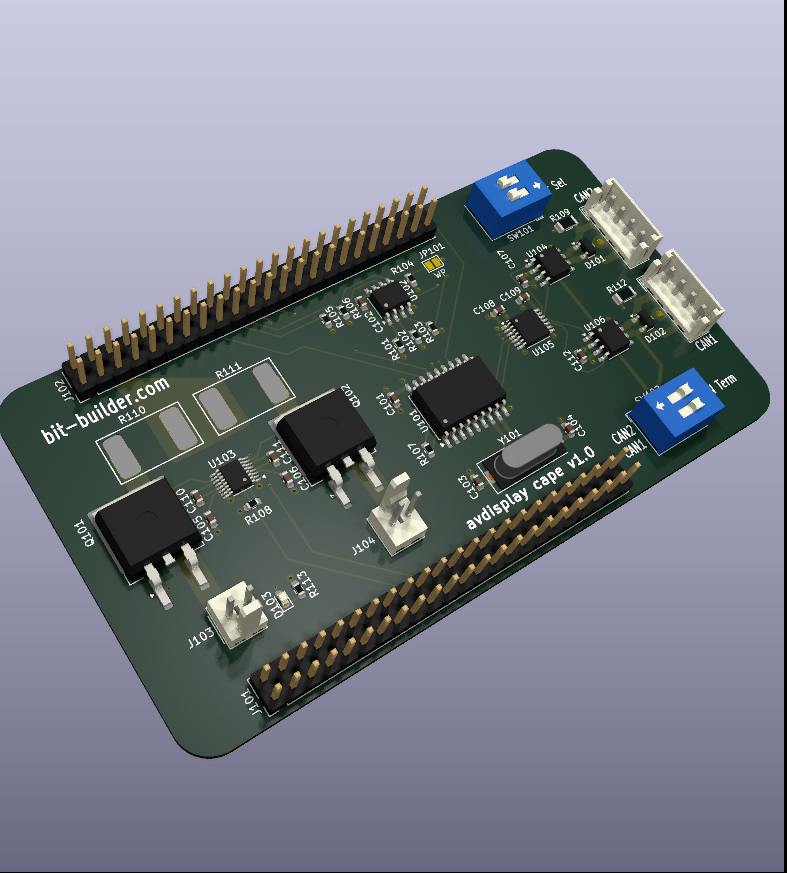

# Avdisplay Cape

Kicad design for beaglebone black cape. Provides Dual CAN bus & bus
protection. Provides 4A of 5V power to the beaglebone black using dual
offboard 1.5A switching power supplies. These are load balanced using
a LTC4370 device. Since the project is also using a LCD display, only
one of the beaglebone's dual CAN devices is available due to pin
conflicts, so another external MCP2515 CAN controller connected via SPI is
onboard.

## Offboard power supplies

The design is intended to use two Sparkfun [buck boost power
supplies](https://www.sparkfun.com/products/15208) which use a
TPS63070 device. The input range is 3-16V. The project is supplied
from a 12V system. The output on the breakout boards is selected to 5V
and each device connected to the board with the provided JST
connectors. With a heatsink installed on each device, they are capable
of providing 2A for a total of 4A. The 12V input should have diode
protection and a fuse as those are not installed on either the
buck-boost breakout boards or the cape.

## View and Schematics

